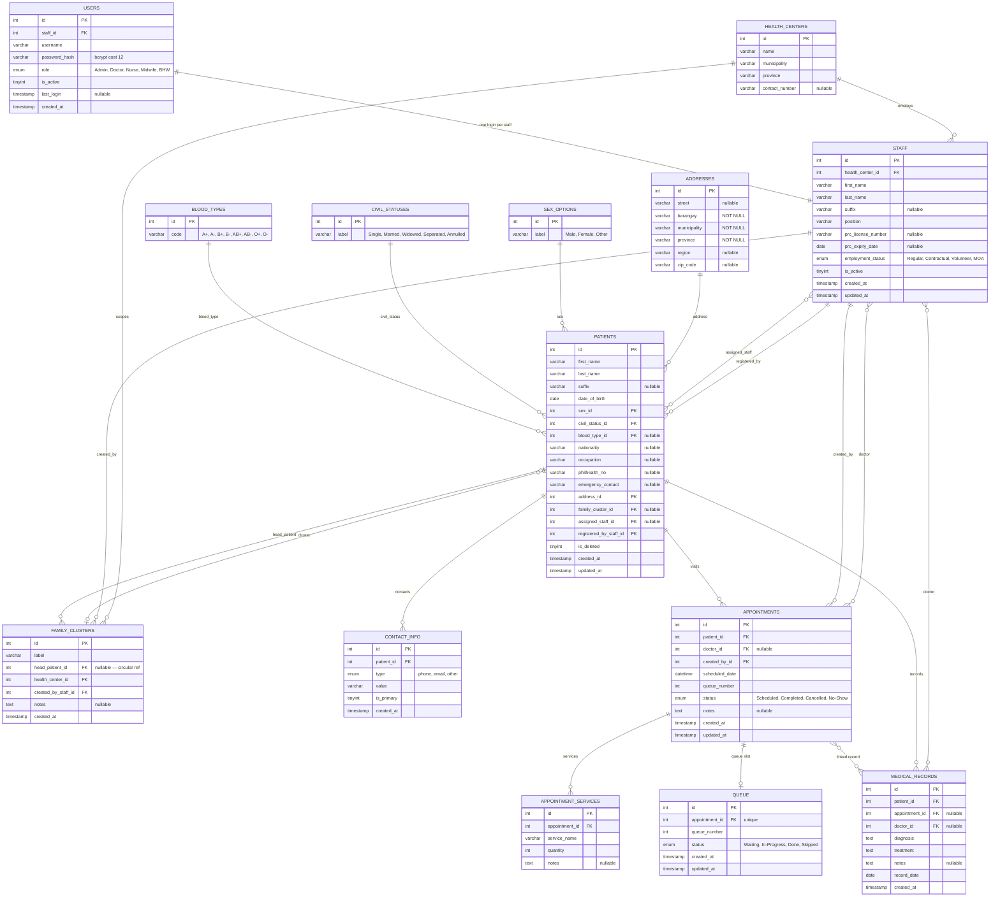

# LikhaHealth — Implementation Plan & System Requirements
**Angono Municipal Health Center Patient Management System**
*Version 1.3 · May 2026 — Updated: Normalized schema; Phase 1 complete; Phase 2 in progress*

---

## 1. System Overview

LikhaHealth is a locally-deployed patient management system designed to digitize and automate the core operations of the Angono Municipal Health Center. It replaces paper-based record-keeping and manual queue management with a structured, role-based web application.

### Core Goals
- Automate patient registration and queue management
- Provide doctors with structured digital consultation records
- Enable SMS-based patient notifications
- Generate operational reports for administrators
- Enforce role-based access control between all staff roles

---

## 2. System Requirements

### 2.1 Functional Requirements

#### 🔐 Authentication & Access Control
- [x] Users log in with **username** and password (not email)
- [x] Five roles: **Admin (MHO)**, **Doctor**, **Nurse**, **Midwife**, **BHW**
- [x] JWT-based sessions (8h expiry); persist on page refresh via `localStorage`
- [x] Wrong role/credentials returns an inline error (no page redirect)
- [x] Portal mismatch guard: Doctor account rejected in Medical Staff portal and vice versa
- [x] Protected route middleware: all `/api/*` endpoints (except login) require `Authorization: Bearer <token>`
- [ ] Doctors cannot access receptionist-only screens (SMS Logs, Patient Registration from doctor portal)
- [ ] Receptionists cannot access clinical consultation records (doctor portal)

#### 👩‍💼 Medical Staff — Receptionist Module
| Feature | Status | Description |
|---------|:---:|-------------|
| Dashboard | 🎨 UI done | Live queue overview, stats, now-serving banner |
| Register Patient | 🎨 UI done | Multi-step form: demographics → address → contacts → cluster |
| Queue Management | 🎨 UI done | View all patients, update status, filter by status |
| Patient Records | 🎨 UI done | Search, view, and edit patient master records |
| Appointments | 🎨 UI done | View, create, confirm, and cancel scheduled appointments |
| SMS Logs | 🎨 UI done | View history of all outbound SMS messages with status |
| Reports | 🎨 UI done | Daily/weekly/monthly patient and queue statistics |

#### 👨‍⚕️ Doctor Module
| Feature | Status | Description |
|---------|:---:|-------------|
| Dashboard | 🎨 UI done | My queue today, scheduled appointments, completion stats |
| My Queue | 🎨 UI done | Patients assigned to this doctor, call next, vitals view |
| Consultations | 🎨 UI done | Start/resume consultations, diagnosis, prescription |
| Patient Records | 🎨 UI done | Full medical history per patient (read + write) |
| Appointments | 🎨 UI done | View and manage personal schedule |
| Reports | 🎨 UI done | View daily/weekly/monthly statistics |

#### 📋 Queue Management Logic
- Queue numbers auto-increment per day per `appointments.queue_number`
- Priority patients move to front of display (not removed from number sequence)
- Status flow: `Waiting → In-Progress → Done` (Skipped for no-shows)
- Queue resets at midnight or manual close

> [!WARNING]
> **ON HOLD: Public Queue Display (Calling System)**
> The exact method for visibly "calling" patients (TV display vs. SMS-only) is undecided. The frontend calling functionality is built into the Receptionist/Doctor UI. The public-facing waiting line display is paused until hardware/logistics are finalized.

#### 📱 SMS Notification Triggers
- New patient registration → queue number + confirmation
- Appointment reminder (day before)
- Queue called (patient's turn)

---

### 2.2 Non-Functional Requirements

| Category | Requirement |
|----------|-------------|
| **Deployment** | Local network only (LAN), XAMPP stack |
| **Performance** | Page loads < 2s on local network |
| **Availability** | Operational during clinic hours (6 AM – 10 PM) |
| **Security** | bcrypt cost-12 password hashing, role-gated routes |
| **Scalability** | Supports up to 5 concurrent staff users, 200+ patients/day |
| **Backup** | Daily MySQL dump via scheduled task |
| **Browser Support** | Chrome/Edge latest — no IE |

---

## 3. Technology Stack

```
Frontend         React 19 + Vite 8 (JSX, no TypeScript)
Styling          Vanilla CSS-in-JS (inline styles per component)
Charts           Recharts
State            React useState/useContext + useAuth hook
Auth Store       JWT in localStorage (lh_token key)
─────────────────────────────────────────────────────────────
Backend          Node.js + Express.js (CommonJS)
Auth             JWT (jsonwebtoken) + bcrypt (bcryptjs, cost 12)
Database Access  mysql2 (raw queries via promise pool)
SMS API          Semaphore PH (local SMS gateway) — Phase 4
─────────────────────────────────────────────────────────────
Database         MySQL 8.x (via XAMPP)
Runtime          Node.js v20 LTS
Package Mgr      npm
Local Server     XAMPP (Apache + MySQL on port 3306)
```

---

## 4. Entity Relationship Diagram (ERD)

> **v1.3 — Full normalized schema. Four layers: Lookups → Core → Patient Domain → Operational.**



---

## 5. Implementation Phases

### ✅ Phase 1 — Foundation: Schema, Auth & API *(Week 1–2 — COMPLETE)*

> All items delivered and verified in production as of May 2026.

**Database**
- [x] Design normalized ERD — 4 layers, 14 tables
- [x] Write `schema.sql` — all tables with FK constraints, indexes, and `SET FOREIGN_KEY_CHECKS`
- [x] Write `seed.sql` — 10 staff users (bcrypt cost-12 hashes), 20 patients, 4 family clusters, 15 addresses, 5 today's appointments + queue slots, 4 medical records
- [x] Initialize MySQL database via XAMPP (`C:\xampp\mysql\bin\mysql.exe`)
- [x] Verified: all 14 tables created; all 10 user accounts load correctly

**Backend**
- [x] Express.js server on port 5000 with CORS for `localhost:5173`
- [x] `POST /api/auth/login` — bcrypt verify → JWT sign → return `{ token, user }`
- [x] `GET /api/auth/me` — JWT-protected; returns current staff profile
- [x] JWT middleware (`middleware/auth.js`) — `Authorization: Bearer <token>` validation
- [x] All routes protected: `/patients`, `/staff`, `/queue`, `/appointments`, `/medical-records`, `/sms`, `/dashboard`
- [x] Fixed controllers: JOIN `staff` (not removed `doctors` table) in queue, appointment, and medical records controllers
- [x] `appointments.created_by_id` read from JWT payload (`req.user.staffId`)

**Frontend**
- [x] `useAuth` hook — hydrates user from stored JWT on page refresh; checks expiry; exposes `login` / `logout`
- [x] Route guard in `App.jsx` — unauthenticated users redirected to Login; no flash
- [x] `Login.jsx` — removed stale `ACCOUNTS` mock; calls real `POST /api/auth/login`; portal mismatch error displayed inline
- [x] Token stored in `localStorage` as `lh_token`; cleared on logout
- [x] Persistent session: page refresh does not log out user if token is still valid

---

### 🔄 Phase 2 — Patient & Queue Core *(Week 3–4 — IN PROGRESS)*

**Patient Registration**
- [ ] Wire `PatientRegistration.jsx` form → `POST /api/patients`
- [ ] Address autocomplete: reuse existing `addresses` rows (match barangay)
- [ ] Contact fields: submit to `contact_info` table (type = `phone` / `email`)
- [ ] Family cluster suggestion: GET `/api/patients?last_name=X` → suggest cluster
- [ ] Form validation (required fields, DOB max = today, philhealth format)
- [ ] Success state: show generated patient ID + queue number

**Queue Management**
- [ ] Wire `ReceptionistQueue.jsx` → `GET /api/queue` (today's queue)
- [ ] Real-time polling: re-fetch queue every 30s (or manual refresh)
- [ ] Status update buttons → `PATCH /api/queue/:id/status`
- [ ] "Call next" action → `GET /api/queue/next`
- [ ] Book a walk-in: create appointment + auto-assign queue → `POST /api/appointments`
- [ ] Filter queue by status (Waiting / In-Progress / Done / Skipped)

**Appointments**
- [ ] Wire `ReceptionistAppointments.jsx` → `GET /api/appointments?date=today`
- [ ] Create appointment form → `POST /api/appointments` (with `services[]`)
- [ ] Cancel appointment → `DELETE /api/appointments/:id` (soft cancel)
- [ ] Update appointment → `PUT /api/appointments/:id`

**Dashboard**
- [ ] Wire `ClinicDashboard.jsx` → `GET /api/dashboard/stats` + `GET /api/dashboard/recent`

---

### 📅 Phase 3 — Doctor Module *(Week 5–6)*

**Doctor Dashboard & Queue**
- [ ] Wire `DoctorDashboard.jsx` → dashboard stats filtered by `doctor_id = req.user.staffId`
- [ ] Wire `DoctorQueue.jsx` → `GET /api/queue?doctor_id=X` — show only assigned patients
- [ ] Call next patient action (update queue to `In-Progress`)

**Medical Records / Consultations**
- [ ] Wire `DoctorConsultations.jsx` → `POST /api/medical-records`
- [ ] Consultation form: diagnosis (freetext) + treatment plan + notes
- [ ] View consultation → `GET /api/medical-records/:id`
- [ ] Per-patient history → `GET /api/medical-records/patient/:id`
- [ ] Link record to appointment on submit (`appointment_id` in body)
- [ ] After save: update appointment status → `Completed`

**Patient Records (Doctor View)**
- [ ] Wire `DoctorPatientRecords.jsx` → `GET /api/patients/:id` with full history
- [ ] Show clinical timeline: medical records sorted by `record_date DESC`

---

### 📱 Phase 4 — SMS Notifications *(Week 7)*

- [ ] Register Semaphore PH API key in `server/.env` as `SMS_API_KEY`
- [ ] Implement `smsController.send` using Semaphore PH REST API
- [ ] Trigger SMS on patient registration (queue number + wait estimate)
- [ ] Trigger SMS on appointment creation (date/time confirmation)
- [ ] Trigger SMS on queue called (`PATCH /api/queue/:id/status` → `In-Progress`)
- [ ] Scheduled reminder: day-before appointment SMS (cron or manual batch)
- [ ] Wire `ReceptionistSMSLogs.jsx` → `GET /api/sms/history`
- [ ] Per-patient SMS history → `GET /api/sms/patient/:id`

---

### 📊 Phase 5 — Records & Reports *(Week 8)*

**Patient Records (Receptionist View)**
- [ ] Wire `ReceptionistPatientRecords.jsx` → `GET /api/patients` with search (last name, barangay)
- [ ] Patient detail view: demographics + contacts + address + family cluster
- [ ] Edit patient info → `PUT /api/patients/:id`
- [ ] Soft-delete / archive → `DELETE /api/patients/:id` (sets `is_deleted = 1`)

**Reports**
- [ ] Wire `ReceptionistReports.jsx` → `GET /api/dashboard/stats`
- [ ] Daily report: registrations, queue completions, no-shows, avg wait time
- [ ] Weekly/monthly aggregates (filter by date range)
- [ ] Barangay breakdown: patients grouped by `addresses.barangay`
- [ ] Family cluster summary: members per cluster
- [ ] CSV export: serialized patient list or report data

---

### 🚀 Phase 6 — QA, Polish & Deployment *(Week 9–10)*

- [ ] End-to-end testing: login → register patient → queue → consultation → records
- [ ] Role boundary testing: doctor cannot access receptionist-only screens, vice versa
- [ ] Error boundary components in React (handle API failures gracefully)
- [ ] Loading states and empty states on all data-driven screens
- [ ] XAMPP deployment configuration (autostart MySQL + Node on boot)
- [ ] Daily backup script: `mysqldump likhaheath > backup_YYYYMMDD.sql`
- [ ] Staff training documentation (login, patient registration, queue flow)
- [ ] Capstone demo preparation

---

## 6. API Endpoint Summary

### Auth
| Method | Endpoint | Auth | Description |
|--------|----------|:----:|-------------|
| POST | `/api/auth/login` | — | Login; returns JWT + user payload |
| GET | `/api/auth/me` | ✅ | Get current user from token |

### Patients
| Method | Endpoint | Auth | Description |
|--------|----------|:----:|-------------|
| GET | `/api/patients` | ✅ | Search/list patients (filter by last_name, barangay) |
| POST | `/api/patients` | ✅ | Register new patient |
| GET | `/api/patients/:id` | ✅ | Get patient + address + contacts |
| PUT | `/api/patients/:id` | ✅ | Update patient info |
| DELETE | `/api/patients/:id` | ✅ | Soft-delete (sets is_deleted = 1) |

### Queue
| Method | Endpoint | Auth | Description |
|--------|----------|:----:|-------------|
| GET | `/api/queue` | ✅ | Get today's queue (JOIN appointments + patients + staff) |
| GET | `/api/queue/next` | ✅ | Get next Waiting patient |
| PATCH | `/api/queue/:id/status` | ✅ | Update queue status; syncs appointment on Done |

### Appointments
| Method | Endpoint | Auth | Description |
|--------|----------|:----:|-------------|
| GET | `/api/appointments` | ✅ | List (filter by date, status, doctor_id) |
| GET | `/api/appointments/today` | ✅ | Today's appointments with queue status |
| POST | `/api/appointments` | ✅ | Create + auto-assign queue number |
| GET | `/api/appointments/:id` | ✅ | Get appointment + services |
| PUT | `/api/appointments/:id` | ✅ | Update appointment |
| DELETE | `/api/appointments/:id` | ✅ | Soft cancel |

### Medical Records
| Method | Endpoint | Auth | Description |
|--------|----------|:----:|-------------|
| GET | `/api/medical-records` | ✅ | List (filter by patient_id, doctor_id) |
| POST | `/api/medical-records` | ✅ | Create record (Doctor RBAC enforced) |
| GET | `/api/medical-records/:id` | ✅ | Get single record |
| GET | `/api/medical-records/patient/:id` | ✅ | All records for a patient |

### Staff
| Method | Endpoint | Auth | Description |
|--------|----------|:----:|-------------|
| GET | `/api/staff` | ✅ | List all staff |
| POST | `/api/staff` | ✅ | Create staff profile |
| GET | `/api/staff/:id` | ✅ | Get staff member |
| PUT | `/api/staff/:id` | ✅ | Update staff profile |
| PATCH | `/api/staff/:id/status` | ✅ | Toggle active/inactive |

### SMS
| Method | Endpoint | Auth | Description |
|--------|----------|:----:|-------------|
| POST | `/api/sms/send` | ✅ | Send manual SMS |
| GET | `/api/sms/history` | ✅ | List all SMS logs |
| GET | `/api/sms/patient/:id` | ✅ | SMS history for patient |

### Dashboard
| Method | Endpoint | Auth | Description |
|--------|----------|:----:|-------------|
| GET | `/api/dashboard/stats` | ✅ | Today's summary stats |
| GET | `/api/dashboard/recent` | ✅ | Recent patient activity |

---

## 7. Security Considerations

| Risk | Mitigation |
|------|-----------|
| Unauthorized access | JWT tokens with role claim; server-side middleware on every endpoint |
| Credential exposure | bcrypt cost 12 for password hashing; never stored or logged as plaintext |
| SQL Injection | Parameterized queries via `mysql2` prepared statements on all controllers |
| CORS | Restricted to `http://localhost:5173` origin only |
| Session hijacking | 8h JWT expiry; sign-out clears token from localStorage |
| Patient data privacy | No cloud storage; LAN-only; access logged via `users.last_login` |
| Role boundary violations | Doctor RBAC check in `medicalRecordController`; portal mismatch guard on Login |

---

> [!IMPORTANT]
> All patient data is stored **locally** on the health center's machine. No data is transmitted to external servers except outbound SMS via the Semaphore PH API.

> [!NOTE]
> The SMS feature requires a registered Semaphore PH account. An API key must be stored in `server/.env` as `SMS_API_KEY` before Phase 4 begins.
