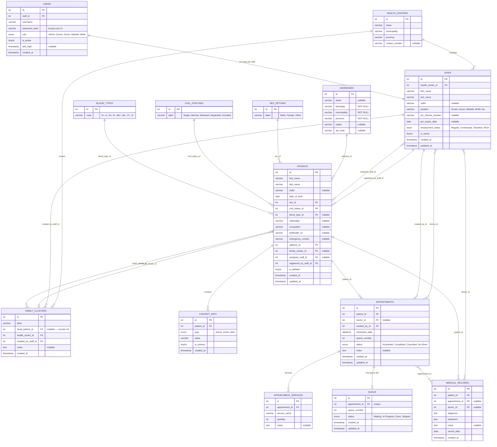
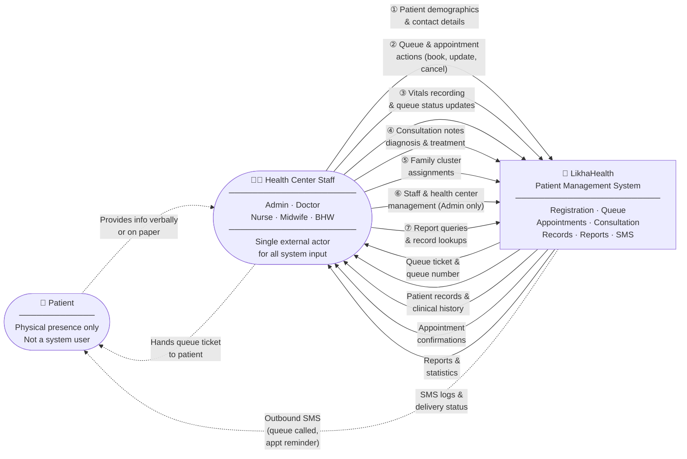

# MHC Patient Management System — Phase 1 System Diagrams
**LikhaHealth · Angono Municipal Health Center**
*Version 1.3 · May 2026 — Updated: Operational tables added; DFDs reflect full system scope*

---

> [!IMPORTANT]
> **Architecture Notes (v1.3)**
> - **One actor type:** All system users are **Health Center Staff**. This includes nurses, midwives, BHWs, doctors, and the Municipal Health Officer (MHO).
> - **The MHO** (head doctor) is simply a staff member with `role = Admin`. No separate entity needed.
> - **Patients** have no system access. All data is entered by staff on the patient's behalf.
> - Access to features is governed by the `role` field on the `users` table, not by actor type.
> - **v1.3 adds:** Queue, Appointment, and Medical Records processes; data stores D7–D9 added to Level 1 DFD.

---

## 1. Role-Based Access Matrix

| Capability | Admin (MHO) | Doctor | Nurse | Midwife | BHW |
|---|:---:|:---:|:---:|:---:|:---:|
| Patient registration | ✅ | ✅ | ✅ | ✅ | ✅ |
| Queue management | ✅ | ✅ | ✅ | ✅ | — |
| Record vitals | ✅ | ✅ | ✅ | ✅ | — |
| Book appointments | ✅ | ✅ | ✅ | ✅ | — |
| Start consultation / medical records | ✅ | ✅ | — | — | — |
| Family cluster assignment | ✅ | ✅ | ✅ | ✅ | — |
| Send / view SMS logs | ✅ | — | ✅ | ✅ | — |
| View reports | ✅ | ✅ | ✅ | ✅ | — |
| Manage staff accounts | ✅ | — | — | — | — |
| Manage health center config | ✅ | — | — | — | — |

---

## 2. Schema Gap Analysis (Current → Normalized Target)

> **Status as of v1.3: All gaps resolved in schema.sql.**

| Current Field (`patients` table) | Status | Action |
|---|---|---|
| `address TEXT` | ✅ Done | Extracted → `addresses` table; `address_id FK` on patients |
| `contact_number VARCHAR` | ✅ Done | Moved → `contact_info` table (type = `phone`) |
| `email VARCHAR` | ✅ Done | Moved → `contact_info` table (type = `email`) |
| `emergency_contact VARCHAR` | ✅ Keep | Retained as structured `VARCHAR` (name + number) |
| `gender ENUM` | ✅ Done | Renamed to `sex_id FK` → `sex_options` lookup |
| `blood_type ENUM` | ✅ Done | `blood_type_id FK` → `blood_types` lookup |
| `philhealth_id` | ✅ Done | Renamed to `philhealth_no` |
| `is_deleted` | ✅ Keep | Soft-delete flag, unchanged |
| `suffix` | ✅ Done | Nullable field added to `patients` |
| `civil_status` | ✅ Done | `civil_status_id FK` → `civil_statuses` lookup |
| `nationality` | ✅ Done | `VARCHAR` added |
| `occupation` | ✅ Done | `VARCHAR` (freetext) added |
| `family_cluster_id FK` | ✅ Done | FK → `family_clusters` (nullable) |
| `assigned_staff_id FK` | ✅ Done | FK → `staff` (nullable — BHW/midwife) |
| `registered_by_staff_id FK` | ✅ Done | FK → `staff` (audit trail) |

**Operational tables (new in v1.3):**

| Table | Status | Purpose |
|---|---|---|
| `appointments` | ✅ Done | Scheduled visits; replaces old queue-only booking |
| `appointment_services` | ✅ Done | Services rendered per appointment |
| `queue` | ✅ Done | Real-time queue slot per appointment; status lifecycle |
| `medical_records` | ✅ Done | Diagnosis + treatment per patient per visit |

**`users` / `staff` tables:**

| Issue | Action |
|---|---|
| `doctors` and `medical_staff` are separate tables | ✅ Done — merged into unified `staff` table |
| `users.role` doesn't include `Admin` | ✅ Done — ENUM: `Admin, Doctor, Nurse, Midwife, BHW` |
| No MHO/head doctor distinction | ✅ Done — MHO = staff record with `role = Admin` |

---

## 3. Entity Relationship Diagram — Phase 1 Normalized

> `PK` = Primary Key · `FK` = Required Foreign Key · `FK?` = Nullable Foreign Key

---

## 4. Level 0 — Context Diagram

> **v1.3 update:** System outputs now include appointment confirmations, consultation summaries, and SMS logs. Data flows reflect the full operational scope (registration → queue → consultation → records).

---

## 5. Level 1 DFD — Major Processes

> **v1.3 update:** Three new processes added — **P5 Queue & Appointment Management**, **P6 Clinical Consultation & Records**, and **P7 SMS Notifications**. Data stores D7–D9 added for the operational layer. All process-to-store flows updated.

```mermaid
flowchart TD

    %% ── External Actors ──────────────────────────────────────────
    HS(["👩‍⚕️ Health Center Staff\nAdmin · Doctor · Nurse · Midwife · BHW"])
    PT(["🧑 Patient\n(at counter / receives SMS)"])

    %% ── Data Stores ──────────────────────────────────────────────
    D1[("D1 · patients")]
    D2[("D2 · family_clusters")]
    D3[("D3 · addresses")]
    D4[("D4 · contact_info")]
    D5[("D5 · staff / users")]
    D6[("D6 · health_centers")]
    D7[("D7 · appointments\n+ appointment_services")]
    D8[("D8 · queue")]
    D9[("D9 · medical_records")]

    %% ── P1: Patient Registration ─────────────────────────────────
    subgraph P1["P1 · Patient Registration & Profile Management\n(All staff roles)"]
        direction TB
        P1a["Collect demographics\nfrom patient at counter"]
        P1b["Create or reuse\naddress record"]
        P1c["Store contact records\nphone / email"]
        P1d["Suggest cluster\nby surname (read-only)"]
    end

    %% ── P2: Family Cluster ───────────────────────────────────────
    subgraph P2["P2 · Family Cluster Management\n(Nurse · Midwife · Doctor · Admin)"]
        direction TB
        P2a["Search patients\nby surname"]
        P2b["Create or update\ncluster record"]
        P2c["Assign patient\nto cluster"]
    end

    %% ── P3: Staff & System Management ───────────────────────────
    subgraph P3["P3 · Staff & System Management\n(Admin only)"]
        direction TB
        P3a["Create / update\nstaff profile"]
        P3b["Manage user login\naccounts & roles"]
        P3c["Configure health\ncenter settings"]
    end

    %% ── P4: Reporting & Record Lookup ────────────────────────────
    subgraph P4["P4 · Reporting & Record Lookup\n(All roles — Admin sees all)"]
        direction TB
        P4a["Search by surname,\nbarangay, or cluster"]
        P4b["Generate family\nhealth summary"]
        P4c["Generate barangay /\nperiodic reports"]
    end

    %% ── P5: Queue & Appointment Management ──────────────────────
    subgraph P5["P5 · Queue & Appointment Management\n(Nurse · Midwife · Doctor · Admin)"]
        direction TB
        P5a["Book appointment\nfor patient"]
        P5b["Auto-assign queue\nnumber for today"]
        P5c["Update queue status\nWaiting → In-Progress → Done"]
        P5d["Cancel or reschedule\nappointment"]
    end

    %% ── P6: Consultation & Medical Records ───────────────────────
    subgraph P6["P6 · Consultation & Medical Records\n(Doctor · Admin only)"]
        direction TB
        P6a["Start consultation\nfrom queue or walk-in"]
        P6b["Record diagnosis\n& treatment plan"]
        P6c["Link record to\nappointment (optional)"]
        P6d["View patient's\nclinical history"]
    end

    %% ── P7: SMS Notifications ────────────────────────────────────
    subgraph P7["P7 · SMS Notifications\n(Nurse · Midwife · Admin)"]
        direction TB
        P7a["Send queue confirmation\non registration"]
        P7b["Send appointment\nreminder (day before)"]
        P7c["Send queue called\nnotification"]
    end

    %% ── Offline patient handoff ──────────────────────────────────
    PT -. "Verbal / written info\nat registration counter" .-> HS

    %% ── Staff → Processes ────────────────────────────────────────
    HS -->|"Enters patient data\non patient's behalf"| P1
    HS -->|"Cluster search\nand assignment"| P2
    HS -->|"Staff / config\nmanagement (Admin)"| P3
    HS -->|"Report and\nrecord queries"| P4
    HS -->|"Books, updates,\ncancels appointments"| P5
    HS -->|"Records consultation\nnotes (Doctor)"| P6
    HS -->|"Triggers manual\nSMS sends"| P7

    %% ── P1 ↔ Data Stores ─────────────────────────────────────────
    P1 -->|"Write patient record"| D1
    P1 -->|"Write or reuse address"| D3
    P1 -->|"Write contact records"| D4
    D2 -->|"Cluster suggestions\n(read-only)"| P1

    %% ── P2 ↔ Data Stores ─────────────────────────────────────────
    D1 -->|"Read patients\nby surname"| P2
    P2 -->|"Write / update cluster"| D2
    P2 -->|"Update patient's\nfamily_cluster_id"| D1

    %% ── P3 ↔ Data Stores ─────────────────────────────────────────
    P3 -->|"Write / update\nstaff & user records"| D5
    P3 <-->|"Read / write\nhealth center config"| D6

    %% ── P4 ↔ Data Stores ─────────────────────────────────────────
    D1 -->|"Read patients"| P4
    D2 -->|"Read clusters"| P4
    D3 -->|"Read addresses\nbarangay filter"| P4
    D5 -->|"Read assigned staff"| P4
    D7 -->|"Read appointment\nhistory"| P4
    D9 -->|"Read medical\nrecords for reports"| P4

    %% ── P5 ↔ Data Stores ─────────────────────────────────────────
    D1 -->|"Read patient info\nfor booking"| P5
    D5 -->|"Read available doctors"| P5
    P5 -->|"Write appointment\n& services"| D7
    P5 -->|"Write queue entry\n(auto-number)"| D8
    P5 -->|"Update appointment\nstatus"| D7
    P5 -->|"Update queue\nstatus"| D8

    %% ── P6 ↔ Data Stores ─────────────────────────────────────────
    D1 -->|"Read patient profile\n& history"| P6
    D8 -->|"Read queue slot\n(In-Progress)"| P6
    D7 -->|"Read linked appointment\n(optional)"| P6
    P6 -->|"Write medical record\n(diagnosis + treatment)"| D9
    P6 -->|"Update appointment\nstatus → Completed"| D7

    %% ── P7 ↔ Data Stores ─────────────────────────────────────────
    D1 -->|"Read patient\ncontact info"| P7
    D4 -->|"Read phone number"| P7
    D7 -->|"Read appointment\ndetails for reminder"| P7
    D8 -->|"Read queue number\nfor notification"| P7

    %% ── Outputs → Staff ──────────────────────────────────────────
    P1 -->|"Queue ticket /\nconfirmation"| HS
    P4 -->|"Reports &\nstatistics"| HS
    P5 -->|"Appointment\nconfirmation"| HS
    P6 -->|"Consultation\nsummary"| HS

    %% ── Outputs → Patient (offline + SMS) ────────────────────────
    HS -. "Hands queue ticket\nto patient" .-> PT
    P7 -. "SMS: queue number,\nappt reminder,\ncalled notification" .-> PT
```

---

## 6. Migration Checklist — Phase 1

> All items completed as of May 2026.

**Patient Domain (Normalization)**
- [x] Create `health_centers` table
- [x] Create `addresses` table — extracted from `patients.address TEXT`
- [x] Create `contact_info` table — migrated `patients.contact_number` (phone) and `patients.email`
- [x] Create `family_clusters` table (scoped to `health_center_id`)
- [x] Create lookup tables: `blood_types`, `civil_statuses`, `sex_options`
- [x] Merge `doctors` + `medical_staff` into unified `staff` table
- [x] Update `users.role` ENUM to: `Admin, Doctor, Nurse, Midwife, BHW`
- [x] Designate MHO staff record as `role = Admin`
- [x] Add normalized columns to `patients`: `suffix`, `sex_id`, `civil_status_id`, `blood_type_id`, `nationality`, `occupation`, `philhealth_no`, `emergency_contact`, `address_id`, `family_cluster_id`, `assigned_staff_id`, `registered_by_staff_id`
- [x] Add indexes: `patients(last_name)`, `patients(family_cluster_id)`, `addresses(barangay)`

**Operational Tables (New in v1.3)**
- [x] Create `appointments` table with `created_by_id FK`, `doctor_id FK → staff`, `queue_number`
- [x] Create `appointment_services` table
- [x] Create `queue` table with unique `appointment_id` constraint and status lifecycle
- [x] Create `medical_records` table with `doctor_id FK → staff`
- [x] Add indexes: `appointments(scheduled_date)`, `appointments(patient_id)`, `queue(status)`, `medical_records(patient_id)`
- [x] Fix controllers: `queueController`, `appointmentController`, `medicalRecordController` — JOIN `staff` (not removed `doctors` table)

**Auth & Seed**
- [x] Seed `users` with bcrypt cost-12 hashes for all 10 staff accounts
- [x] Seed `appointments` + `queue` with today's schedule (5 slots)
- [x] Seed `medical_records` with 4 historical clinical entries
- [x] Verified: `POST /api/auth/login` returns valid JWT
- [x] Verified: `GET /api/auth/me` returns user behind JWT guard
- [x] Verified: `GET /api/queue` returns today's queue with patient + doctor names
